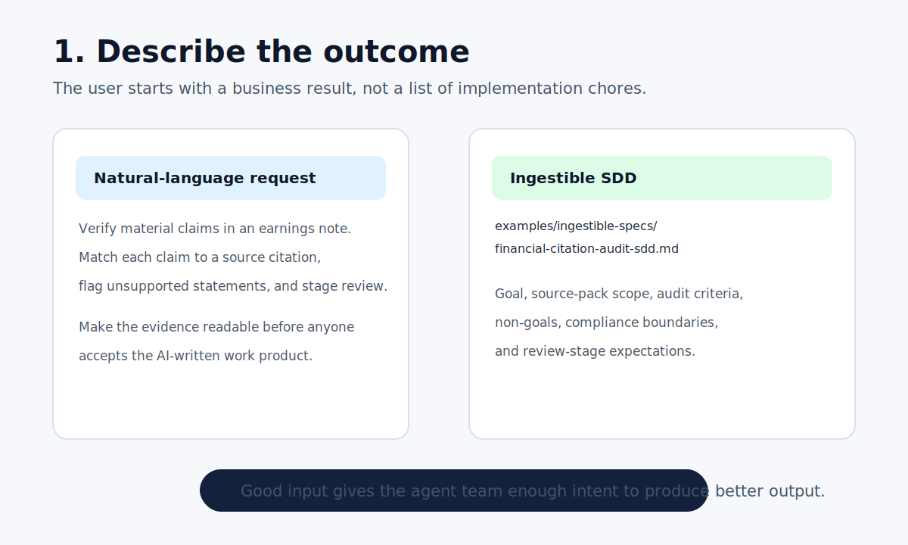
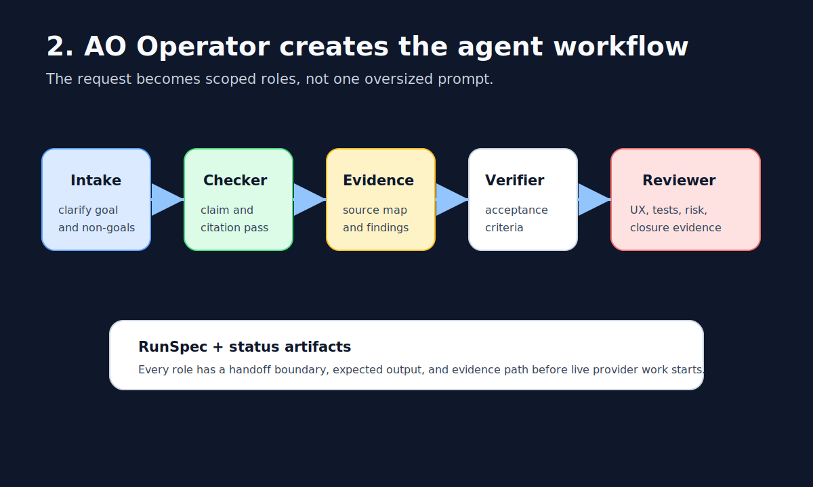
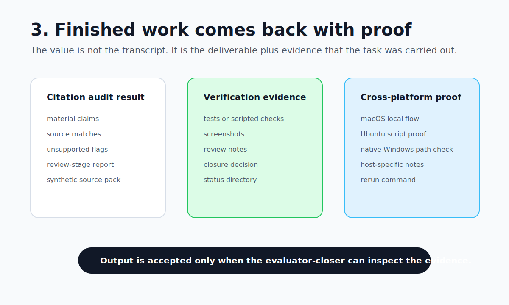
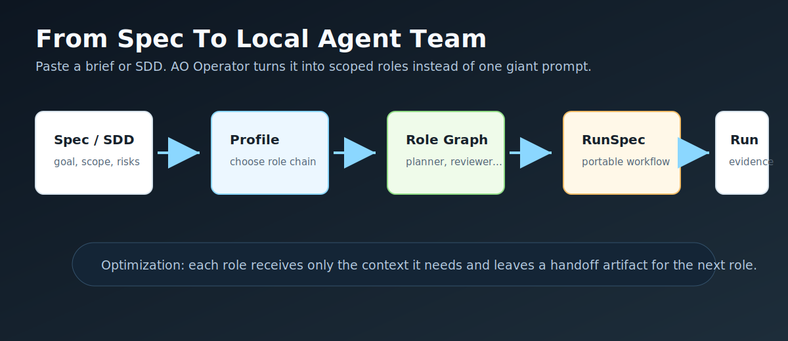
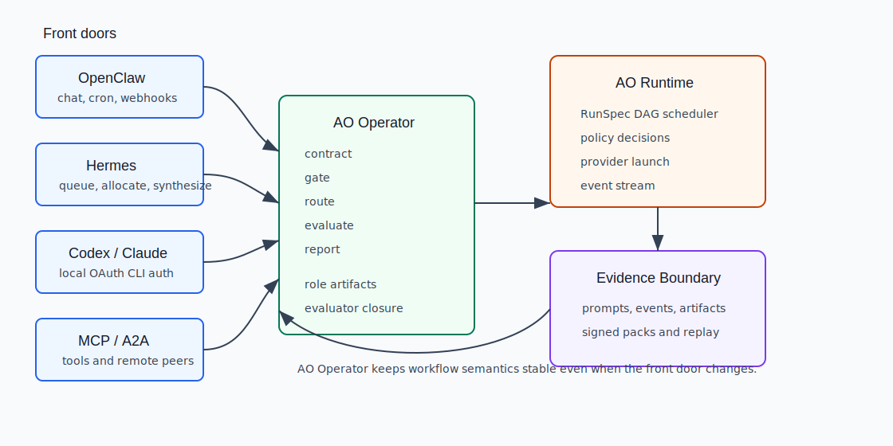
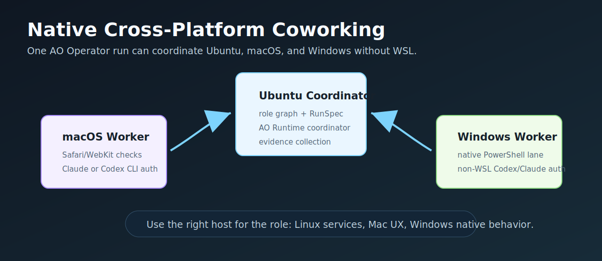
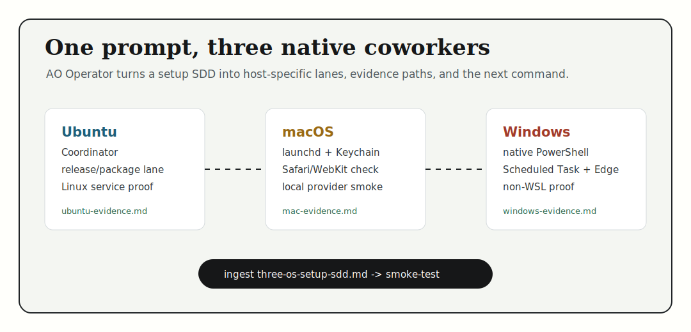
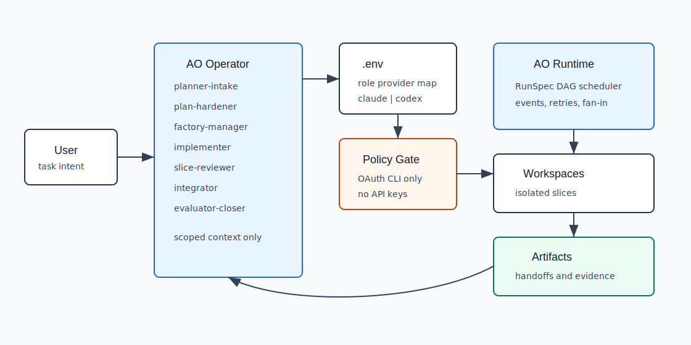
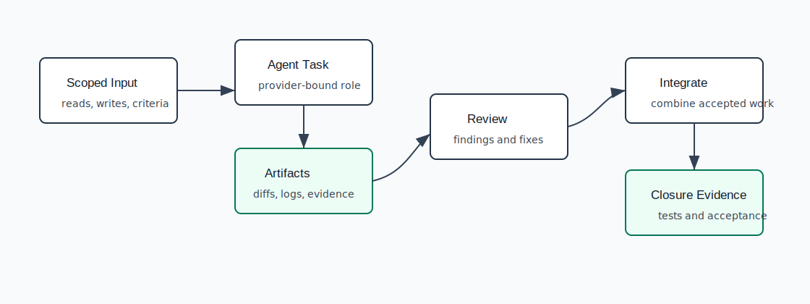

# AO Operator

**English** | [日本語](./docs/ja/README.md) | [简体中文](./docs/zh-Hans/README.md) | [繁體中文](./docs/zh-Hant/README.md) | [한국어](./docs/ko/README.md)

> AO stands for **AI Orchestration Operation**. Product name:
> **AO Operator**. GitHub repo slug: `ao-operator`.


**AO Operator is the AI Orchestration Operation layer: describe the outcome in
natural language, and it drives Codex or Claude Code toward a verified
deliverable.** Give it a product request, an SDD, or a task brief. It turns that
intent into scoped roles, cross-platform checks, RunSpecs, status artifacts, and
evidence you can review.

Start here when you want an AI CLI to carry work to done instead of leaving you
with a chat transcript to babysit. AO Operator is built for result-oriented
work: create an app sample from an engineering spec, improve a repo over time,
validate behavior on macOS/Ubuntu/Windows, and keep each role accountable for
evidence before the closer accepts the run.

AO Operator is also the product layer for the wider AO adapter surface:
OpenClaw can submit, schedule, and observe work; Hermes-style queues can drive
worker-saturation runs; AO Runtime keeps provider dispatch, policy, events, and
evidence underneath. The operator gives those plugin and adapter flows a
consistent role contract instead of making every integration invent its own
workflow semantics.

## Paste Into Codex Or Claude Code

Do not start by copying shell commands into a terminal. Start in the AI CLI you
already use. Open **Codex CLI** or **Claude Code** in a parent directory where a
new checkout can be created, then paste this prompt:

```text
Try AO Operator without spending live provider tokens.

Goal:
- Clone https://github.com/uesugitorachiyo/ao-operator.git if it is not already present.
- Enter the repo.
- Read examples/ingestible-specs/financial-citation-audit-sdd.md.
- Materialize that SDD with the smoke-test profile using the provider-free
  ingestion path.
- Do not set OPENAI_API_KEY or ANTHROPIC_API_KEY.
- Stop and explain the blocker if Python 3 or git is missing.

Report back with:
- the workflow outcome requested by the SDD;
- the public wedge AO Operator is proving;
- the role graph AO Operator created;
- the generated RunSpec path;
- the status directory path;
- what the live Codex/Claude execution would do next.
```

Expected report shape:

```text
requested outcome: financial citation audit workflow
public wedge: citation and compliance review with signed paper trail
profile loaded: smoke-test
role graph: intake -> test-engineer -> evaluator-closer
runspec: run-artifacts/ingest-financial-citation-audit-sdd/ingest-financial-citation-audit-sdd.runspec.yaml
```

That first run is provider-free. It shows the value before spending live Codex
or Claude Code tokens: AO Operator ingests a high-level product request, chooses
roles, writes a RunSpec, and materializes the evidence paths needed to carry the
work forward. Live execution uses your existing local `codex` or `claude` CLI
login, so subscription users can drive structured multi-role work without
managing API keys.

Want the fastest useful trial? Paste the financial-services SDD-style brief and
let AO Operator turn it into a local agent team by asking Codex or Claude Code:

```text
In the AO Operator repo, ingest the financial-services SDD at
examples/ingestible-specs/financial-citation-audit-sdd.md with the smoke-test profile.

Then enter the sibling financial-services profile repo and run:

python3 -m financial_services_profile.cli public-proof --run-id public-sec-citation-proof

Summarize the requested outcome, generated role graph, RunSpec path, status
directory, `public-proof.json`, `public-proof.md`, evidence-pack path, and
verify/replay verdicts.
```

For the financial-services profile prompt, use
[`docs/guides/codex-claude-financial-services-profile-prompt.md`](docs/guides/codex-claude-financial-services-profile-prompt.md).
It starts from a high-level citation-audit outcome and asks Codex or Claude Code
to report the role graph, RunSpec, status directory, and evidence path that a
live provider run would continue from.

For the shortest complete trial, use
[`docs/guides/try-ao-operator-in-5-minutes.md`](docs/guides/try-ao-operator-in-5-minutes.md).
It starts in Codex CLI or Claude Code and shows the generated role graph,
RunSpec, status directory, and next evidence-producing step.





## Why Try It

AO Operator is useful when a single chat window is too loose, but a full hosted
agent platform is too much.

| If you want... | AO Operator gives you... |
| --- | --- |
| Clear natural-language requests carried to done | Outcome intake, role planning, execution packets, review gates, and closer acceptance |
| More value from Codex / Claude Code subscriptions | Local provider CLI auth, role chains, and repeatable runs instead of one-off prompts |
| App or feature work from an SDD | Greenfield roles turn a spec into a plan, implementation lane, review lane, and verification evidence |
| Confidence before accepting an AI result | Scoped reads/writes, provider rules, policy gates, and reviewer roles |
| A way to debug what the agent did | Status directories, rendered prompts, events, artifacts, and replayable evidence packs |
| Plugin and adapter workflows beyond one chat provider | OpenClaw layering, Hermes-style queue/factory flows, and MCP/A2A execution through AO Runtime |
| Domain demos beyond toy examples | Financial-services citation audit and secure-agent coding profiles |
| Native multi-OS product work | Ubuntu, macOS, and Windows non-WSL workers can cooperate on one run |

Coming from Superpowers, GSD, gstack, or Spec-Kit-style workflows? Read
[`docs/guides/coming-from-superpowers-gsd-gstack.md`](docs/guides/coming-from-superpowers-gsd-gstack.md)
and the direct comparison guide
[`docs/guides/ao-operator-vs-superpowers-gsd-gstack.md`](docs/guides/ao-operator-vs-superpowers-gsd-gstack.md).

## What It Can Do

- Turn a natural-language product request or SDD into a scoped plan, role graph,
  implementation path, review path, and closure artifact.
- Start from outcome specs like
  [`financial-citation-audit-sdd.md`](examples/ingestible-specs/financial-citation-audit-sdd.md)
  to produce role packets, RunSpecs, and evidence paths for a real vertical
  workflow.
- Split bigger work into role chains that preserve context across steps without
  forcing the requester to describe every technical detail.
- Run Codex and Claude Code through the same local operator contract.
- Layer OpenClaw and Hermes-style queue/factory flows above the same operator
  contract instead of treating them as separate one-off scripts.
- Export workflows as `.factory/runspec.yaml` so they can be reviewed or moved.
- Produce signed evidence packs for runs you need to audit or replay later.
- Use profile repos as reusable playbooks for finance, secure coding, and future
  domains.

The trust layer is still important: AO Operator can run under fail-closed policy
and emit signed, replayable evidence packs. But the first reason to try it is
simple: it turns intent into finished, reviewable work while preserving the
evidence needed to understand and repeat the result.

## How Agentic Workflows Actually Run

AO Operator takes the useful parts of public agent practices — reusable skills,
SDD-style outcome specs, scoped planning, verification gates, and portable
command shape — and packages them into a local workflow:

```text
SDD / brief -> profile -> role graph -> RunSpec -> role artifacts -> closure
```



The role graph is not decoration. It is how the workflow spends context and
keeps responsibility clear:

| Role | Job | Why it helps |
| --- | --- | --- |
| `intake` | clarifies goal, non-goals, assumptions, blockers | stops a vague prompt from becoming a vague patch |
| `planner` | turns the brief into the smallest useful plan | prevents the implementer from inventing scope |
| `implementer` | makes the bounded change or draft | uses focused context instead of the whole conversation |
| `reviewer` | checks risk, missed cases, and acceptance criteria | gives you adversarial review before closure |
| `integrator` | combines role outputs and evidence | keeps handoffs readable across longer work |
| `evaluator-closer` | accepts or rejects completion | makes "done" depend on evidence, not optimism |

Each role receives a narrower packet than a single giant chat would need, then
leaves an artifact for the next role. That is the main reason to download it:
you can turn a copy-pasted spec into a repeatable local agent workflow before
spending live provider tokens.

For a deeper walkthrough, read
[`docs/guides/from-sdd-to-agent-team.md`](docs/guides/from-sdd-to-agent-team.md).

## Plugin And Adapter Surface

AO Operator does not have to be the only front door. It can sit behind or beside
other operator surfaces while preserving the same contract, gates, and evidence:



```text
OpenClaw:  submit / schedule / observe
Hermes:    allocate / saturate workers / synthesize closure
AO Operator: contract / gate / route / evaluate / report
AO Runtime: execute providers / enforce policy / emit events
```

The important boundary is ownership. OpenClaw is useful for chat, cron,
webhook, cancellation, and status UX. Hermes-style queueing is useful when the
goal is saturating multiple Codex-backed factories over a time budget. AO
Operator still owns the role contracts, provider routing, profile semantics,
handoff artifacts, and evaluator closure. AO Runtime owns the lower-level
OpenClaw adapter, Hermes plugin bridge, MCP/A2A adapters, policy decisions, and
event stream.

The reference integration is
[`examples/layered-openclaw-ao/`](examples/layered-openclaw-ao/), with deeper
contracts in [`docs/sdd/01-architecture.md`](docs/sdd/01-architecture.md) and
[`docs/sdd/03-interfaces-and-contracts.md`](docs/sdd/03-interfaces-and-contracts.md).
Runtime validation is pinned by `@ao-runtime/openclaw-adapter`,
`@ao-runtime/hermes-plugin`, and `openclaw-transport` tests in AO Runtime.

## Native Mac, Ubuntu, And Windows Coworking

AO Operator is designed for real product work that crosses operating systems.
Ubuntu can coordinate a run, macOS can validate launchd/Safari/Keychain behavior,
and Windows can run native PowerShell, Scheduled Task, Edge, installer, and path
checks without WSL.



This is useful for users replacing loose agent workflows because a single brief
can become OS-specific role lanes:

```text
Ubuntu: release captain, service verifier, package builder
macOS: Safari/WebKit check, launchd validation, provider smoke
Windows: native PowerShell lane, scheduled task check, non-WSL bug reproduction
```

Provider authentication stays local to each host. A Windows worker uses the
Windows machine's local Codex or Claude Code CLI login; Mac uses its own login;
Ubuntu uses its own login. AO Operator does not require provider API keys to be
transported through a hosted control plane.

The current layered Codex smoke is accepted on all three hosts: macOS, Ubuntu,
and native Windows without WSL. Each host runs the same one-file declared-write
task through local Codex CLI auth, AO Runtime events, AO Operator gates, and an
evaluator check that requires `Result: ACCEPTED`.

Native Windows currently uses a bounded `FACTORY_V3_CODEX_SANDBOX=danger-full-access`
override for this smoke because the Codex CLI `workspace-write` shell runner
times out on that host. macOS and Ubuntu use the normal local provider path.

For setup and the Windows-initiated outbound SSH topology, read
[`docs/guides/native-cross-platform-coworking.md`](docs/guides/native-cross-platform-coworking.md)
and [`docs/cross-host-setup.md`](docs/cross-host-setup.md).

Want the one-step prompt first? Run the provider-free setup SDD:



```bash
bash scripts/ingest_spec_demo.sh examples/ingestible-specs/three-os-setup-sdd.md smoke-test
```

## Public Repo Set

The repos are public together, but the advertisement should still name one
product: **AO Operator**. The other repos are there so technical users can
inspect the engine, run the flagship profiles, and understand the roadmap
without guessing how the pieces fit.

| Repo | What it is | How to read it |
| --- | --- | --- |
| `ao-operator` | The product: role contracts, RunSpecs, provider routing, evidence packs, release gates | **Start here. Clone this first.** |
| [`ao-runtime`](https://github.com/uesugitorachiyo/ao-runtime) | The Rust execution engine: DAG scheduler, policy seam, event log, artifacts, workers, OpenClaw/Hermes/MCP/A2A adapters | Read when you want to understand or embed the engine. |
| [`financial-services-profile`](https://github.com/uesugitorachiyo/financial-services-profile) | Flagship demo profile: citation-sensitive financial workflows over public/synthetic data | Run after AO Operator to see the regulated-workflow story. |
| [`secure-agent-profile`](https://github.com/uesugitorachiyo/secure-agent-profile) | Reusable secure coding-agent profile: guarded patching, dependency review, PR evidence | Run after AO Operator to see policy-gated software work. |
| [`ao-control-plane`](https://github.com/uesugitorachiyo/ao-control-plane) | Future management layer: typed run state, evidence aggregation, release-train gates | Read last. It is not required for the first product trial. |

The stack is designed so a user can start with one local command path, then
inspect each lower layer only when they need more control:

```text
AO Operator -> profiles -> AO Runtime -> AO Control Plane
```

## Hero Use Case

The launch demo is financial-services citation audit because it proves the
operator is not only a prompt wrapper:

```bash
python3 scripts/run_financial_services_sec_edgar_demo.py \
  --slug financial-services-earnings-note \
  --status-dir run-artifacts/financial-services-mvp

python3 scripts/factory_run.py tasks \
  financial-services-earnings-note \
  --profile financial-services:earnings-note \
  --json

# Full financial-services proof is owned by the standalone profile repo.
cd ../financial-services-profile
python3 -m financial_services_profile.cli public-proof --run-id public-sec-citation-proof
```

The AO Operator path uses public SEC EDGAR source data and exposes the
`financial-services:earnings-note` role contract for review. The profile repo
owns the `public-proof` implementation, signed evidence pack, `verify.json`,
`replay.json`, `public-proof.json`, and `public-proof.md`. The claim is not
"AI for finance." The claim is:
**cross-model citation and compliance review with a signed paper trail.**

## Live Three-Host Proof

This proof runs the same live Codex layered smoke on macOS, Ubuntu, and native
Windows. The task is intentionally small but strict: one declared file may
change, the provider must include `Result: ACCEPTED`, and the evaluator records
the accepted run with AO Runtime events and AO Operator artifacts.

Artifacts for review:

- [`docs/assets/layered-smoke-three-host.typescript`](docs/assets/layered-smoke-three-host.typescript)
  is the sanitized `script(1)` terminal transcript.
- The strategy repo keeps optional visual launch assets separately. The README
  stays diagram-first so the product story does not depend on terminal media.

## Status

The public launch foundation includes:

- AO Operator naming decision
- MIT OR Apache-2.0 dual license, contributor guide, code of conduct, issue
  and PR templates
- Workflow-as-data export/import for `.factory/runspec.yaml`
- Five starter profiles and five example briefs
- Financial-services citation-audit profile scaffold
- Spec-Kit-style aliases: `specify`, `plan`, `tasks`, `analyze`
- Layered OpenClaw/AO example and Hermes-style queue/factory integration
  guidance
- Native macOS, Ubuntu, and Windows non-WSL coworking runbook
- Primary hero diagram in `images/ao-operator-agent-team.svg`
- Hacker News draft in `docs/launch/hn-draft.md`

AO Runtime remains the execution engine underneath AO Operator. It is public so
engine users can inspect the scheduler, policy, artifact, worker, and adapter
contracts, but AO Operator remains the first product surface.

Operator release installation, verification, troubleshooting, and security
non-claims are tracked in
[`docs/private-operator-release.md`](docs/private-operator-release.md).

## Architecture



The detailed architecture and design-development docs live in `ao-operator.md`
and `docs/sdd/`. Frozen schema namespaces may still use `ao-operator/*/v1`;
public-facing product names and asset names use AO Operator.

AO Operator keeps control deterministic: `scripts/factory_run.py` is the
Operator Runner that materializes prompts and RunSpecs, invokes AO Runtime,
collects events, and enforces evaluator closure. The script name is retained
for compatibility. Agentic reasoning happens inside bounded DAG roles such as
`factory-manager`, `integrator`, and `evaluator-closer`; there is no outer
orchestrator agent.

## Quickstart

Use local provider CLI auth. Do not configure provider API keys.

```bash
cp .env.example .env
python3 -m venv .venv
. .venv/bin/activate
python -m pip install -r requirements-dev.txt
python3 scripts/factory_run.py --list-profiles
```

Inspect the financial-services role chain after running the ingestible spec demo:

```bash
python3 scripts/factory_run.py tasks ingest-financial-citation-audit-sdd --profile smoke-test --json
```

Try the shortest agent-team example:

```bash
bash scripts/first_run_demo.sh
```

Try an ingestible SDD-style spec:

```bash
bash scripts/ingest_spec_demo.sh examples/ingestible-specs/financial-citation-audit-sdd.md smoke-test
```

Try the non-technical service booking app proof:

```bash
python3 examples/service-booking-recovery-app/verify.py
bash scripts/ingest_spec_demo.sh examples/ingestible-specs/service-booking-recovery-sdd.md greenfield
```

Expected fixture signal: `saveable_revenue=13400`.

Run the provider-free public-launch smoke before telling anyone to try the
repo. It copies the checkout to a temporary clean workspace, validates the
scaffold, runs the first-run demo, ingests the financial-services citation
audit SDD, ingests the secondary service-booking app SDD, ingests the bug-fix
SDD, ingests the three-OS setup SDD, and writes a compact report:

```bash
python3 scripts/public_launch_smoke.py
```

Expected report:

```text
run-artifacts/public-launch-smoke/latest.md
run-artifacts/public-launch-smoke/latest.json
```

Or run the same steps manually:

```bash
python3 scripts/factory_run.py specify examples/agent-team-demo/task-brief.md \
  --slug agent-team-demo \
  --profile bug-fix \
  --overwrite-artifacts
```

Render a dry-run operator package from an example brief:

```bash
python3 scripts/factory_run.py specify examples/starters/bug-fix-example.md --slug demo-bug-fix --overwrite-artifacts
```

Export and re-import the workflow-as-data RunSpec:

```bash
python3 scripts/runspec_export.py \
  --slug demo-bug-fix \
  --profile bug-fix \
  --brief examples/starters/bug-fix-example.md \
  --output-path /tmp/ao-operator-demo/bug-fix \
  --json

python3 scripts/runspec_import.py /tmp/ao-operator-demo/bug-fix.factory/runspec.yaml --json
```

## Starter Profiles

Starter profiles live under `profiles/starters/` and are regular
`ao-operator/profile/v1` JSON. The schema namespace is frozen as a wire-format
identifier even though the repository is now `ao-operator`:

| Profile | Use |
| --- | --- |
| `bug-fix` | Narrow defect fix with intake, planner, implementer, reviewer, closer |
| `refactor` | Behavior-preserving refactor with an explicit plan-hardener pass |
| `greenfield` | New tool or feature slice with an architect role |
| `doc-update` | Fast documentation update with evidence-backed closure |
| `smoke-test` | Read-only verification that an existing feature still works |

Example briefs live under `examples/starters/`.

Copy-pasteable SDD-style specs live under `examples/ingestible-specs/`.

## Workflow As Data

AO Operator can export a role chain as `.factory/runspec.yaml`:

```yaml
schema: ao-operator/runspec/v1
slug: bug-fix
profile: bug-fix
brief: examples/starters/bug-fix-example.md
roles:
  - id: intake
    provider_key: FACTORY_V3_PLANNER_PROVIDER
    host_tag: []
    deps: []
    reads:
      - task brief
    writes:
      - run-artifacts/<slug>/roles/intake.md
gates:
  gate_b: true
  gate_r: true
```

This is meant to make workflows reviewable and portable without adding a second
orchestration engine.

## Provider Rules

AO Operator resolves each role's provider from `.env`. Valid values are:

```text
codex
claude
```

Authentication must use local OAuth/subscription CLI login:

- `codex`: Codex CLI auth
- `claude`: Claude Code CLI auth

`OPENAI_API_KEY`, `ANTHROPIC_API_KEY`, and provider API-key auth paths are
forbidden for this project.

## Core Commands

```bash
python3 scripts/factory_run.py --list-profiles
python3 scripts/factory_run.py --show-providers --profile bug-fix
python3 scripts/factory_run.py specify examples/starters/greenfield-example.md
python3 scripts/factory_run.py plan demo-slug --profile greenfield --json
python3 scripts/factory_run.py tasks demo-slug --profile bug-fix --json
python3 scripts/factory_run.py analyze demo-slug --profile smoke-test --json
pytest -q
```

Live provider execution is still available through the native runner:

```bash
python3 scripts/factory_run.py \
  --brief examples/starters/bug-fix-example.md \
  --profile bug-fix \
  --slug live-bug-fix \
  --run
```



Signed evidence packs are opt-in for live runs. Provide a 32-byte hex HMAC
key for local/dev runs, or an Ed25519 PEM private key for production runs. The
runner writes the pack under `run-artifacts/<slug>/evidence-packs/`, creates
`evidence-pack-<run_id>.tar.zst`, and replay-verifies it before returning
success:

```bash
export FACTORY_V3_EVIDENCE_HMAC_KEY_HEX="$(python3 -c 'import secrets; print(secrets.token_hex(32))')"

python3 scripts/factory_run.py \
  --brief examples/starters/bug-fix-example.md \
  --profile bug-fix \
  --slug live-bug-fix \
  --run \
  --evidence-hmac-key-hex "$FACTORY_V3_EVIDENCE_HMAC_KEY_HEX" \
  --evidence-execute-deterministic
```

Production Ed25519 signing uses the optional `cryptography` package:

```bash
python3 scripts/factory_run.py \
  --brief examples/starters/bug-fix-example.md \
  --profile bug-fix \
  --slug live-bug-fix \
  --run \
  --evidence-ed25519-private-key ./operator-ed25519.pem
```

Verify or replay a pack later with the same key:

```bash
python3 scripts/factory_run.py replay \
  run-artifacts/live-bug-fix/evidence-packs/evidence-pack-<run_id>.tar.zst \
  --hmac-key-hex "$FACTORY_V3_EVIDENCE_HMAC_KEY_HEX" \
  --write-report run-artifacts/live-bug-fix/evidence-packs/evidence-pack-<run_id>-replay.json
```

Replay emits `ao-operator/evidence-pack-replay/v1`: signature/Merkle/CAS
verification, task/event coverage, transcript-path coverage, artifact-reference
coverage, and deterministic non-LLM replay status. For packs with
`deterministic: true` task declarations, replay validates the declared
`replay_command`/`replay_outputs` contract and confirms those outputs resolve to
content-addressed artifacts. Older packs without declarations report that field
as `SKIPPED`.

To also execute deterministic non-LLM replay commands, opt in explicitly:

```bash
python3 scripts/factory_run.py replay \
  run-artifacts/live-bug-fix/evidence-packs/evidence-pack-<run_id>.tar.zst \
  --hmac-key-hex "$FACTORY_V3_EVIDENCE_HMAC_KEY_HEX" \
  --execute-deterministic \
  --deterministic-timeout-seconds 5
```

Execution is sandboxed to a temporary working directory, uses a minimal
environment, runs without a shell, denies common network clients, and compares
declared `replay_outputs` back to the task's CAS hashes.

For live runs, use `--evidence-execute-deterministic` to make the generated
`evidence-pack-<run_id>-summary.json` prove `deterministic_command_execution:
PASS` before closure. `profiles/starters/smoke-test.json` includes the first
starter-level deterministic replay proof contract.

Run the no-provider readiness gate used by `scripts/pr_ready.py`:

```bash
python3 scripts/check_evidence_pack_readiness.py --json
python3 scripts/check_live_evidence_pack_replay.py --json
```

Run the full pre-public three-OS gate only from a operator release operator
machine with target environment variables set:

```bash
python3 scripts/check_three_os_pre_public_gate.py --json
```

## Launch Assets

- Primary hero diagram: `images/ao-operator-agent-team.svg`
- Hero cast source: `docs/assets/hero.cast`
- Recording script: `scripts/record_hero.sh`
- HN draft: `docs/launch/hn-draft.md`
- Financial-services demo profile:
  [`financial-services-profile`](https://github.com/uesugitorachiyo/financial-services-profile)
- Public repository metadata: `docs/launch/public-repo-metadata.md`

The public launch should advertise **AO Operator** as the entry point. The
other public repositories support that story: AO Runtime is the Rust execution
engine, Financial Services Profile is the flagship citation-audit demo, Secure
Agent Profile is the guarded coding-agent profile, and AO Control Plane is the
future management layer. Do not market the five repositories as five separate
products.

## Documentation

- `ao-operator.md` - architecture and operating protocol
- `SETUP.md` - local setup and provider configuration
- `PROMPT_SAMPLES.md` - prompts for common tasks
- `profiles/README.md` - role-chain profile schema
- `ao/runspecs/README.md` - AO RunSpec usage
- `agents/README.md` - role catalog
- `skills/` and `skills.toml` - vendored factory skills
- `docs/launch/hn-draft.md` - public launch copy for the one-product story

## Non-Goals For The Public Launch

- No enterprise compliance package
- No SOC2 or HIPAA-specific fixtures
- No multi-provider router
- No hosted execution service
- No five-product launch narrative
