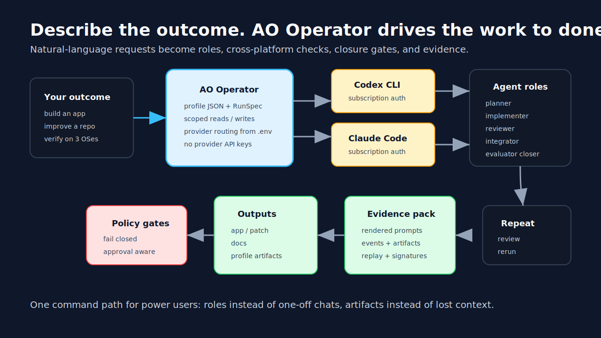

# AO Operator

[English](../../README.md) | **日本語**

> AO は **AI Orchestration Operation (AI オーケストレーション運用)** の略です。
> 製品名: **AO Operator**。GitHub リポジトリスラッグ: `ao-operator`。

> 本ドキュメントは英語版の翻訳です。差異がある場合は英語版を正本とします:
> [`../../README.md`](../../README.md)



**AO Operator は AI オーケストレーション運用層です。成果物を自然言語で記述すると、
Codex または Claude Code を動かして検証済みの納品物まで導きます。** プロダクト
リクエスト、SDD、タスクブリーフを渡すと、AO Operator はそれをスコープ付きロール、
クロスプラットフォームチェック、RunSpec、ステータス成果物、レビュー可能なエビデンスへ
変換します。

「AI CLI に作業を完了まで運ばせたい — チャット履歴のお守りはもう嫌だ」という方は、
ここから始めてください。AO Operator は成果志向の作業向けに作られています: 仕様書から
アプリサンプルを生成する、リポジトリを継続的に改善する、macOS / Ubuntu / Windows で
挙動を検証する、ランの受領前に各ロールがエビデンスを提示する責任を負う、といった
ワークフローを支えます。

AO Operator は、より広い AO アダプタ面の製品層でもあります。OpenClaw は作業の投入・
スケジューリング・観測を、Hermes 系のキューはワーカー飽和ランを担い、AO Runtime は
プロバイダ振り分け・ポリシー・イベント・エビデンスを下層で受け持ちます。AO Operator は
これらプラグイン / アダプタフローに対し、一貫したロール契約を提供します — 各統合が
ワークフロー意味論を独自実装する必要はありません。

## Codex / Claude Code に貼り付ける (Paste Into Codex Or Claude Code)

シェルコマンドをいきなり打ち込まないでください。普段お使いの AI CLI から始めます。
新しいチェックアウトを作れる親ディレクトリで **Codex CLI** か **Claude Code** を開き、
以下のプロンプトを貼り付けてください:

```text
ライブのプロバイダトークンを使わずに AO Operator を試す。

ゴール:
- 未取得なら https://github.com/uesugitorachiyo/ao-operator.git を clone する。
- 当該リポジトリへ移動する。
- examples/ingestible-specs/financial-citation-audit-sdd.md を読む。
- プロバイダ不要の取り込みパスで、smoke-test プロファイルとして上記 SDD を実体化する。
- OPENAI_API_KEY と ANTHROPIC_API_KEY は設定しない。
- Python 3 か git が無ければ停止して原因を説明する。

報告内容:
- SDD が要求するワークフロー結果
- AO Operator が証明している公開ウェッジ
- AO Operator が作成したロールグラフ
- 生成された RunSpec のパス
- ステータスディレクトリのパス
```

(原文の続きは [`../../README.md`](../../README.md) を参照してください)

## 概要 (Overview)

AO Operator は、SDD (仕様駆動文書) や自然言語のタスクブリーフを受け取り、
**役割契約 (role contracts)** に基づいて Codex / Claude Code を含む複数のエージェントを
協調動作させ、検証済みの成果物 (コード、ドキュメント、エビデンスパック) を生成します。
製品の核は次の三点です:

1. **ロール契約**: 各エージェントが「何を出力すべきか」を文書として定義し、評価者が
   その契約に基づいて受領可否を判断します。
2. **RunSpec**: 実行可能な DAG として作業を表現し、AO Runtime 上で再現可能に動かします。
3. **エビデンスパック**: 実行履歴・成果物・署名を 1 つの監査可能なアーカイブに固めます。

## クイックスタート (Quickstart)

詳細な手順は [`./quickstart.md`](./quickstart.md) を参照してください。
セットアップは [`./getting-started.md`](./getting-started.md) を参照してください。

## ライセンス (License)

AO Operator は以下のいずれかのライセンスで、利用者の選択により提供されます:

- [Apache License, Version 2.0](../../LICENSE-APACHE)
- [MIT License](../../LICENSE-MIT)

詳細は [`NOTICE`](../../NOTICE) も参照してください。

明示的にそうでないと述べない限り、本プロジェクトへ意図的に提出された寄与は、
Apache-2.0 ライセンスの定義に従い上記の二重ライセンスで提供されるものとし、追加の
条項は適用されません。

## 翻訳について (About This Translation)

本日本語版は段階的に追加されています。用語集と翻訳方針は
[`./TRANSLATION.md`](./TRANSLATION.md) を参照してください。原文 (英語) と差異が
あれば英語版を正本とします。
