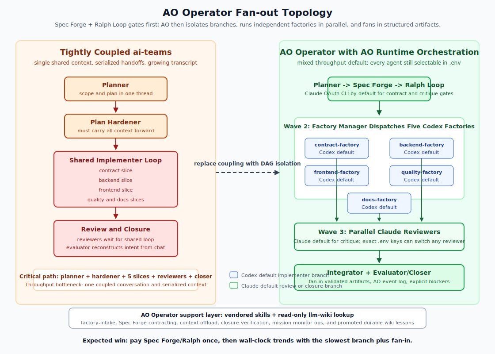

# Outperform ai-teams Fanout Example

This example is designed to show where AO Operator should beat a tightly
coupled ai-teams workflow: independent work streams are expressed as an AO DAG
instead of being serialized through one shared conversation.



## Workload

Build a greenfield multi-tenant analytics workbench with independent slices:

- Product contract and OpenAPI schema.
- Event ingestion API and storage model.
- Operator dashboard UI.
- Quality, security, and performance harness.
- Documentation and setup workflow.

## Required Control Gates

This sample must not jump directly from planner to implementation fan-out.
The target architecture uses:

```text
planner-intake
  -> spec-forge-contract
  -> ralph-loop
  -> plan-hardener
  -> factory-manager
  -> parallel factories
  -> parallel reviewers
  -> integrator
  -> evaluator-closer
```

- `spec-forge-contract` emits machine-checkable SHALLs, acceptance criteria,
  sensitive fields, negative constraints, and slice read/write ownership.
- `ralph-loop` is the pre-dispatch critique gate. It rejects fan-out if the
  contract is vague, branches overlap, or greenfield readiness is not proven.
- `plan-hardener` turns the accepted contract into an executable plan.
- `factory-manager` owns the AO fan-out decision and dispatches only from the
  accepted slice contract.

## Why This Should Outperform Tightly Coupled ai-teams

AO Operator should win on wall-clock throughput because the critical path changes
from "do every role in one coupled sequence" to "contract and critique once,
harden once, fan out, then fan in structured evidence." For this workload, the
five largest work streams contract, backend, frontend, quality, and docs do not
need to block each other after Spec Forge and Ralph Loop prove explicit
ownership and acceptance criteria.

- `ai-teams` bottleneck: planner, hardener, implementer, reviewers, and closer
  share one growing conversation. Every later role inherits more irrelevant
  context, and independent slices still compete for the same serialized turn
  stream.
- `ao-operator` advantage: AO schedules five implementation factories after
  Spec Forge, Ralph Loop, plan hardening, and factory-manager dispatch; each
  branch gets bounded prompt context, declared read/write scope, and its own
  artifact/status output.
- Provider fit improves in the default mixed-throughput profile: Codex OAuth
  CLI handles implementation-heavy branches; Claude OAuth CLI handles Spec
  Forge, Ralph Loop, plan hardening, review, and evaluator closure where
  critique quality matters more than edit throughput. Every named agent remains
  switchable to either provider through `.env`.
- Failure isolation improves: a blocked branch reports a structured STATUS
  block and AO event evidence without contaminating unrelated branch context.
- Closure is cheaper: the evaluator reads reviewed artifacts and AO events
  instead of reconstructing intent from a full transcript.

The expected performance gain is not that any single agent is faster. The gain
comes from reducing serialized turns and transcript drag. For a complex app with
five independent branches, AO Operator wall-clock should trend toward:

```text
planner + Spec Forge + Ralph Loop + plan-hardener + factory-manager
  + max(branch factory + branch reviewer) + integrator + evaluator
```

instead of:

```text
planner + plan-hardener + sum(all implementation and review branches) + evaluator
```

## Files

- `task-brief.md` - user-facing task brief for `factory_run.py`.
- `spec-forge.contract.json` - machine-checkable contract for the target
  factory-of-factories run.
- `provider.env` - recommended mixed-throughput provider profile. Every role
  or exact topology task can still be changed to `codex` or `claude`.
- `ao-fanout-topology.yaml` - illustrative AO DAG showing the intended
  fan-out/fan-in shape that should outperform sequential orchestration.
- `expected-throughput.md` - measurable expectations and acceptance criteria.
- `images/ao-operator-outperform-topology.svg` - embedded topology diagram.

## Run

Dry-run with the current AO Operator CLI:

```bash
python3 scripts/factory_run.py \
  --brief examples/outperform-ai-teams-fanout/task-brief.md \
  --slug outperform-ai-teams-fanout \
  --provider-env examples/outperform-ai-teams-fanout/provider.env \
  --topology examples/outperform-ai-teams-fanout/ao-fanout-topology.yaml \
  --dry-run
```

Validate generated artifacts and the target fan-out topology:

```bash
python3 scripts/validate_factory.py \
  --slug outperform-ai-teams-fanout \
  --topology examples/outperform-ai-teams-fanout/ao-fanout-topology.yaml \
  --contract examples/outperform-ai-teams-fanout/spec-forge.contract.json
```

The full fan-out topology in `ao-fanout-topology.yaml` is the target
factory-of-factories shape for this workload. When `--topology` is supplied,
`factory_run.py` materializes that 17-task DAG, including Spec Forge, Ralph
Loop, factory-manager dispatch, five implementation factories, five reviewers,
integrator fan-in, and evaluator closure. Without `--topology`, the CLI keeps
the baseline seven-role smoke DAG.
